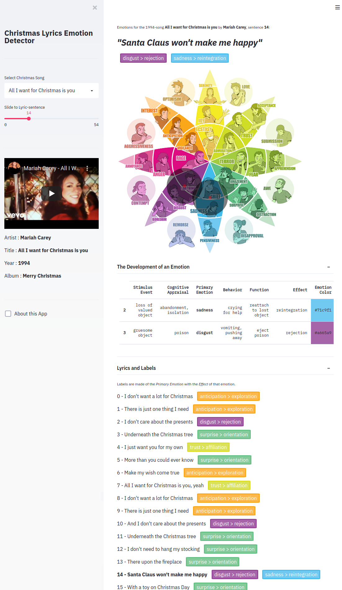

# Christmas Lyrics Emotion Detector

[](https://www.innerdoc.com/christmas-lyrics-emotions-demo/) [](https://twitter.com/innerdoc_nlp)


## About
This *Christmas Lyrics Emotion Detector* is created by [Rob van Zoest](https://www.linkedin.com/in/robvanzoest/) and started with the idea for a fun pre-christmas project: 
- The **code** is available on [github.com/innerdoc](https://github.com/innerdoc/christmas-lyrics-emotion-detector)
- The **emotions** were taken from [Plutchik's wheel of Emotions](https://en.wikipedia.org/wiki/Robert_Plutchik)
- The **data** was generated with the help of *Zero-shot emotion classification* with [Transformers from Huggingface](https://joeddav.github.io/blog/2020/05/29/ZSL.html)
and this [Colab Notebook](https://colab.research.google.com/drive/1gcJq-6YXGca7i_8XUfq9z08MU_EWlkSd)
- The **interface** is build with the help of [Streamlit](https://www.streamlit.io/) and [Plotly](https://plotly.com/python/)


## The result
[Open the demo app!](https://www.innerdoc.com/christmas-lyrics-emotions-demo/)

Below an example of the App.




## Install and run
```
pip install -r requirements.txt
streamlit run christmas_lyrics_emotion_detector.py
```
